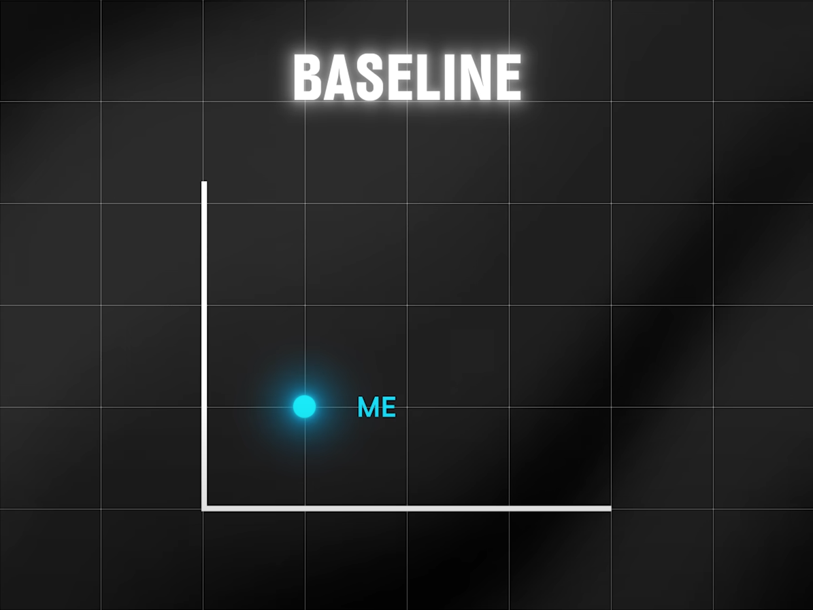
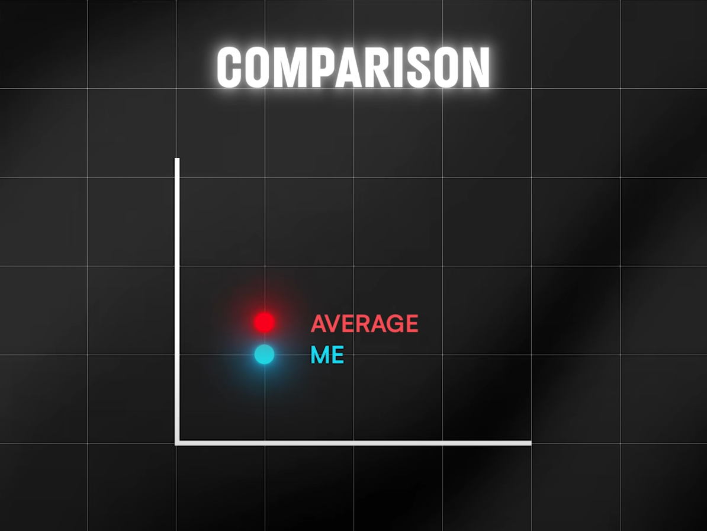
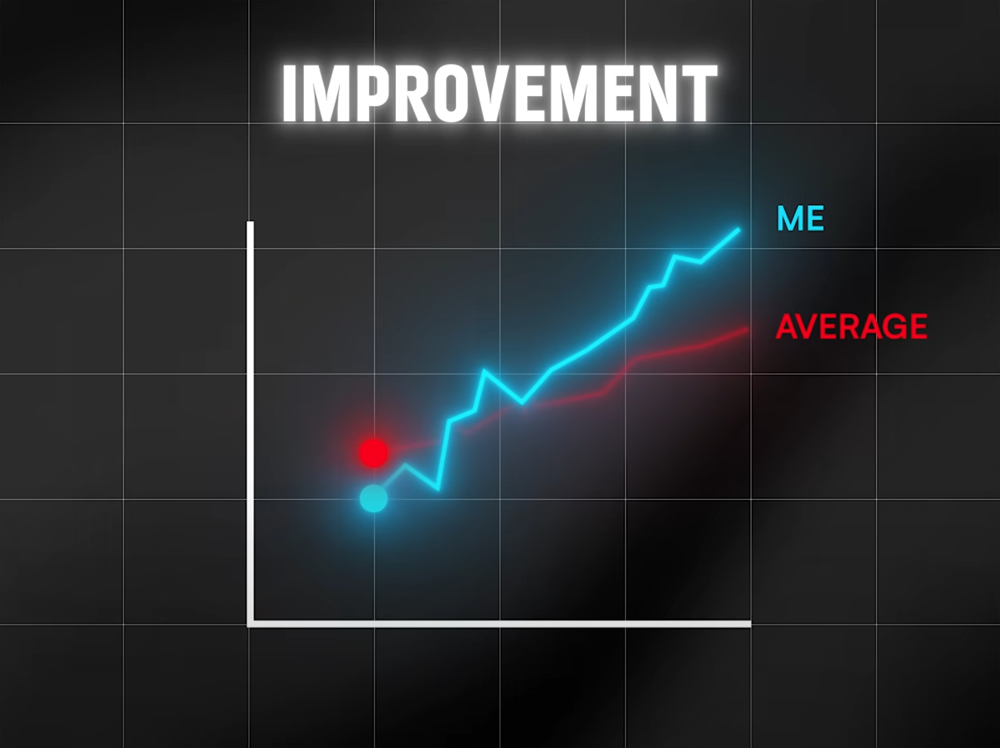

# اندازه‌گیری
## چرا اندازه‌گیری بایومارکرها مهمه و باید مرتب انجام بشه؟

مث آپتیمال کردن فانکشنالیتی هر سیستمی، برای ارزیابی عملکرد سیستم درمقابل تغییراتی که بهش تحمیل میشه، نیازمنده دیتا هستیم تا میزان اثرگذاریش رو بشه ارزیابی کرد.
یه سری چیزا تحقیقات نشون داده ک روتین خوبین و توی گایدلاین‌های معتبری مث WHO ذکر شده. خیلی چیزهای دیگه هم در حال حاضر میزان اثرش ممکنه در هاله‌ای از ابهام باشه. بزار با یه مثالی پیش بریم:

میدونیم ک کلا ورزش خوبه و تاثیرات فوق‌العاده‌ای روی بدن داره. اما سوال پیش میاد ک چ زمانی از روز رو براش اختصاص بدیم ک بطور مثال روی کیفیت خواب تاثیر منفی نذاره. منظور همون فاصله بین آخرین سشن ورزشی و ساعت خواب شب هست. میشه اینجا Resting heart rate رو بعنوان ایندیکیتور در نظر گرفت. حالا برای عمیق‌تر شدن، باید ۳ فاز رو استارت زد:

### ۱. اندازه‌گیری
اینکار برای فهمیدن استیت فعلی سیستم بکار میره. اینکه همین الان اوضاع من چطوره؟ درواقع توی این فاز، بیس‌لاین مشخص میشه. توی مثالمون میشه مانیتور کردن Resting heart rate هنگام خواب.

### ۲. مقایسه
توی این فاز میشه رفت سراغ دیتاهای پابلیک و ولیدی ک از ریسرچ‌های دیگه وجود داره. اینجا، فاز مقایسه هست. توی مثالمون میشه مقایسه کردن Resting heart rate من موقع خواب با اوریج مردان هم سن من.
این فاز حتی میتونه درجه وخامت یا اهمیت بایومارکر مربوطه و میزان انرژیی ک میطلبه رو هم استیمیت کرد.

### ۳. پیشرفت
این فاز، پایش مداوم رو شامل میشه. اینکه گروه سنی-جنسی من چه ترندی رو معمولا دنبال میکنن. حالا من تغییراتی رو اعمال میکنم و در وهله اول سعی میکنم به میانگین برسونم خودم رو. توی گام بعدی، از میانگین فراتر میرم و صرفا خودم رو با گذشتم مقایسه میکنم.
این فاز میشه معادل پایش میزان بهبود Resting heart rate ام.

اینجا چند نکته برای مقدار و میزان پیشرفت مطرح میشه:  
۱. من اصن تا چ حد میتونم پیشرفت کنم؟ محدودیت انسان چقدره؟ از کجا ببعد دیگه جای پیشرفت باید صرفا روی نگهداری چیزی ک هستم فوکس باشم؟  
۲. محاسبه هزینه فرصت: من برای پیشرفت، میتونم چند کار انجام بدم. مهمترین کار چی میتونه باشه؟ چقدر براش هزینه مالی و زمانی بکنم؟ آیا کارایی ک کردم، ارزش مادی و معنوی‌شو داشت؟ بعبارتی آیا هزینه فرصتش میصرفید؟ یادمون   نره ک: «دنیا دار تریدآفه!» 🤭

حالا این قضیه رو میشه به ابعاد دیگه هم بسط داد. مثلا تغییرات رژیم غذایی و دیدن اثرش توی اتریبیوت‌های خون و ....
