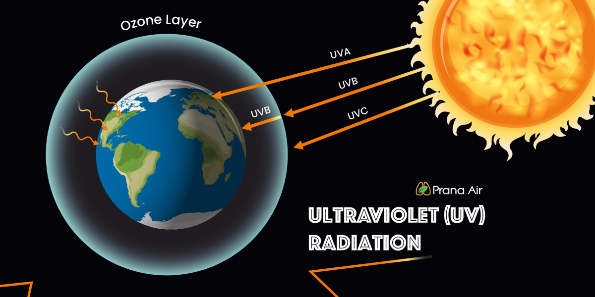
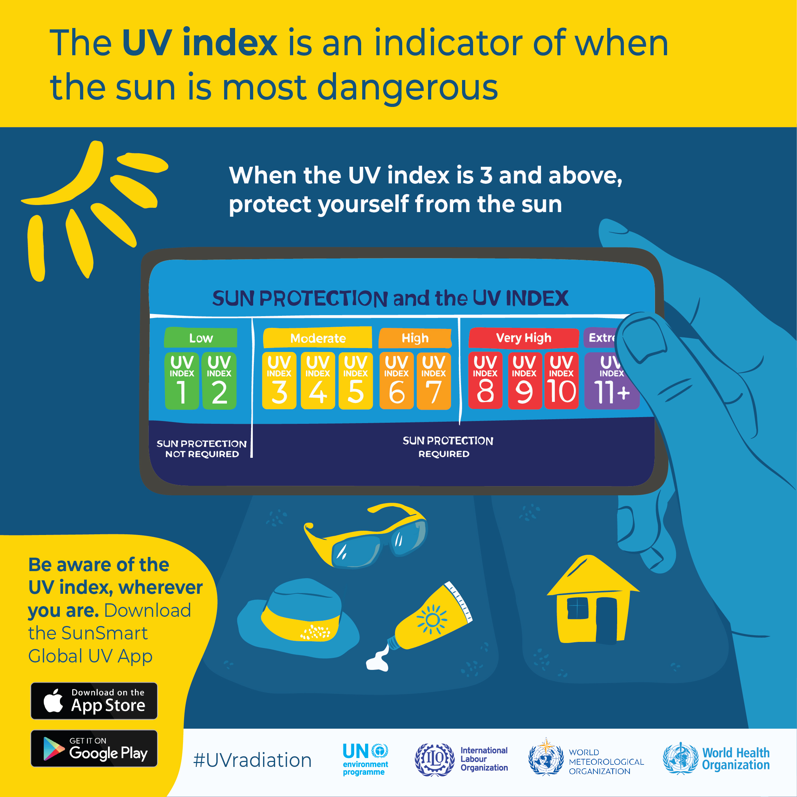
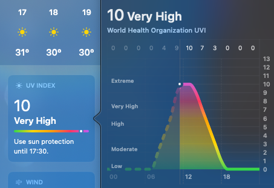
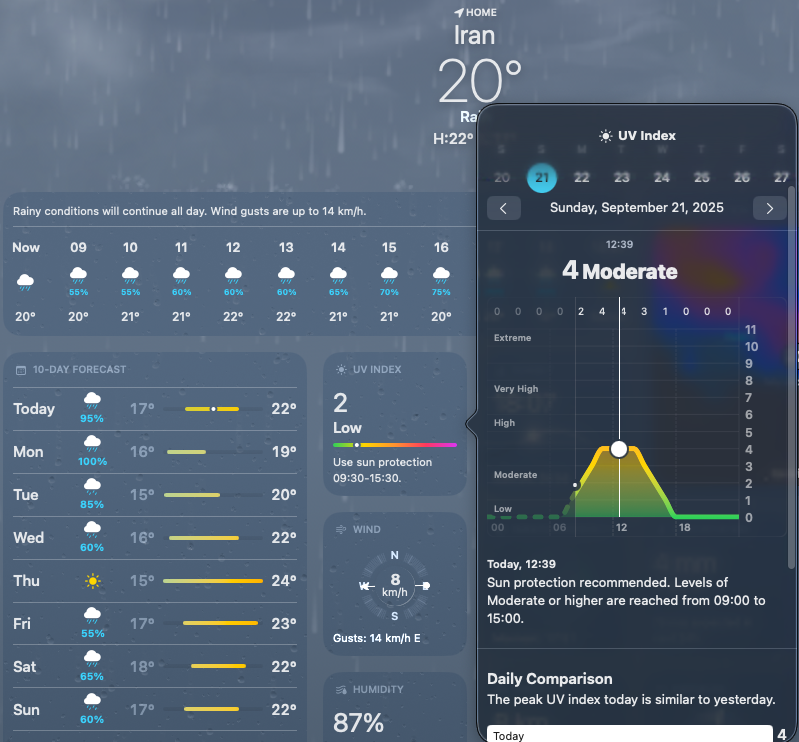

# شاخص UV و سلامت بدن

به سطح زمین، علاوه بر نور مرئی، بخشی از اشعه فرابنفش هم از خورشید دریافت میشه.

این UV ها بر اساس طول موجشون به سه دسته C، B و A تقسیم میشن. UVC که قویترین طول موج رو داره و خیلی برای ما خطرناگه، توسط لایه ازون فیلتر میشه. UVB که توی رتبه بعدی قرار داره، یه بخشیش توسط اتمسفر زمین بلاک میشه. برای همین تو ارتفاعات خیلی بالا مث قله های بزرگ شدتش بیشتر دریافت میشه. و در آخر UVA هم هست ک بیشتر توی سطح زمین دریافت میشه.
حالا، برای اندازه‌گیری میزان UVایی که بهش اکسپوز هستیم معمولا شاخصی به اسم UV Index ارائه میشه که طیفی از ۱ تا مثبت ۱۱ داره.

طبق توصیه سازمان WHO، وقتی ایندکس زیر ۳ باشه، میشه بدون دغدغه از نور خورشید استفاده کرد. اما وقتی ایندکس از ۳ به بالا بره، نیازه از پروتکشن استفاده بشه، مث کرم ضد آفتاب، لباس ضخیم، کلاه و ... . هرچند توصیه اصلی، موندن در مکان های سربسته هست.
پس خوبه ایندکس رو مرتب چک کرد. برای اینکار، میشه از اپ های هواشناسی روی گوشی یا سیستم استفاده کرد.

یه نکته خیلی خیلی مهم این هست که توی هوای ابری و حتی بارونی هم معمولا به پروتکشن نیاز میشه. درواقع ابر جلوی نور رو تا حد زیادی بگیره، ولی تا حد قابل توجهی UV ازش رد میشه. بطور مثال، این نمودار UV Index یه روز بارونی هست:

همونطور که ذکر کرده، نیازه از ساعت ۹ صبح تا ۳ عصر، از پروتکشن توی فضای باز استفاده کرد.